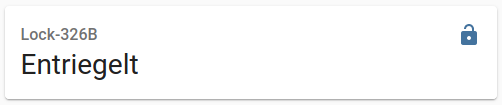
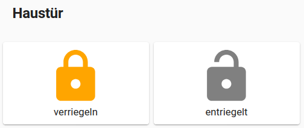

# tedee_lock
Homeassistant Custom Component

This component gives access to a Tedee doorlock. It needs also the Tedee Bridge present and connected to the doorlock.
In my other repository you will find the Python module, that also needs to be installed.

[pytedee](https://github.com/joerg65/pytedee)

To install this component, the files in this repository must be copied to `config/custom_components/tedee_lock`.

Put this lines into the configuration:
```yaml
lock:
  - platform: tedee
    access_token: !secret tedee_pak
```

Please vistit https://tedee-tedee-api-doc.readthedocs-hosted.com/en/latest/howtos/authenticate.html#personal-access-key to generate a token for you.

You will need these scopes:
   - Devices.Read
   - Lock.Operate


After restart of Homeassistant you should see the lock:



Here is how I made a horizontal-stack with two custom button-cards:

```yaml
type: horizontal-stack
title: Haustür
cards:
  - entity: lock.lock_326b
    type: 'custom:button-card'
    state:
      - value: locked
        color: gray
        icon: 'mdi:lock'
        name: verriegelt
      - value: unlocked
        color: orange
        icon: 'mdi:lock'
        name: verriegeln
    tap_action:
      action: call-service
      service: lock.lock
      service_data:
        entity_id: lock.lock_326b
  - entity: lock.lock_326b
    type: 'custom:button-card'
    state:
      - value: unlocked
        color: gray
        icon: 'mdi:lock-open'
        name: entriegelt
      - value: locked
        color: green
        icon: 'mdi:lock-open'
        name: entriegeln
    tap_action:
      action: call-service
      service: lock.unlock
      service_data:
        entity_id: lock.lock_326b
```

